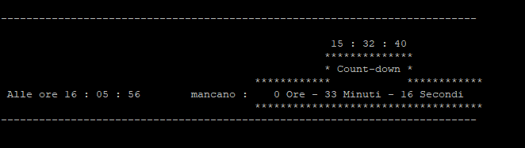

✓ Author: Mattia Pedroncelli© - Date: 2018  mattia.pedroncelli@gmail.com
  
# COUNT DOWN
### Effettua il countdown delle ore, minuti, secondi mancanti ad un determinatao orario impostato

Lo script mostra a video il timing rimanente (ORE, MINUTI, SECONDI) dall'orario attuale rispetto all'orario impostato per il calcolo del countdown.   
 
  
Lanciando lo script (eseguibile da shall Unix), verrà richiesto a video l'inserimento dell'orario su cui effettuare il conteggio del tempo mancante (count-down).  

**Orario in formato HH:MM:SS**

> "INSERIMENTO DELL'ORARIO PER CUI VUOI VENGA ESEGUITO IL COUNT-DOWN"  
> "Inserisci l'ora (HH) : "  
> "Inserisci i minuti (MM) : "  
> "Inserisci i secondi (SS) : "  
 
Script **countdown.py** eseguibile da shall Unix grazie alla prima riga nello script "#!/usr/bin/env python" 
